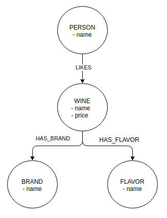
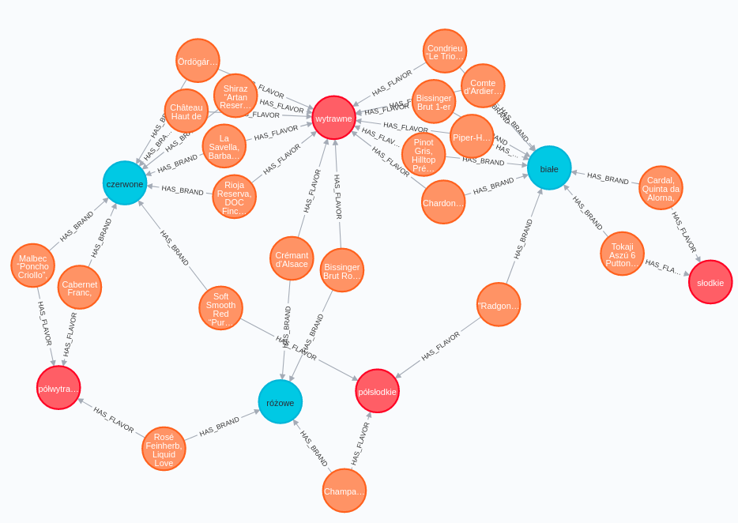
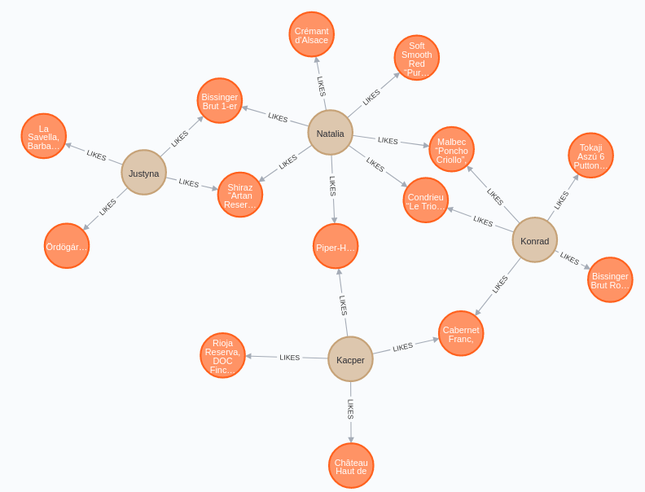

# recomvino

### Autor: Kacper Kapuściak

Projekt zrealizowany został z wykorzystaniem technologi `express` w języku `Javascript`. Połączenie z bazą odbywa się przy pomocy `neo4j-driver`. Do uruchomienia projektu lokalnie wymagane jest środowisko uruchomieniowe `Node.js` w wersji `12` lub wyższej. Projekt został umieszczony na platformie `Heroku`.

Link do projektu: [recomvino-be.herokuapp.com](https://recomvino-be.herokuapp.com/)

Link do interfejsu graficznego: [recomvino.herokuapp.com](https://recomvino.herokuapp.com/)

## Zmienne środowiskowe

Do uruchomienia projektu lokalnie wymaganie jest stworzenie pliku `.env` oraz umieszczenie w nim podanych niżej zmiennych środowiskowych:

| Zmienna      | Opis                                     |
| ------------ | ---------------------------------------- |
| `NEO4J_URI`  | bezpośredni adres IP bazy grafowej Neo4j |
| `NEO4J_USER` | login użytkownika bazy grafowej Neo4j    |
| `NEO4J_PASS` | hasło użytkownika bazy grafowej Neo4j    |

## Skrypty

| Skrypt        | Opis                                      |
| ------------- | ----------------------------------------- |
| `npm start`   | uruchamia aplikacje w trybie produkcyjnym |
| `npm run dev` | uruchamia aplikacje w trybie developmentu |

## Diagram UML



## Struktura projektu

```
├── package.json
├── package-lock.json
├── Procfile
└── src
    ├── app.js
    ├── middleware
    │   ├── db.js
    │   └── error.js
    ├── routes
    │   ├── index.js
    │   ├── likes.js
    │   ├── person.js
    │   ├── recommendations.js
    │   └── wine.js
    └── utils
        ├── formatResponse.js
        └── formatResponseTable.js
```

## Podgląd bazy

Zapytanie w języku `Cypher`:

```Cypher
MATCH p=()-[r:HAS_FLAVOR|:HAS_BRAND]->() RETURN p LIMIT 100
```

zwraca:



**czerwony: smak, niebieski: gatunek, pomarańczowy: wina**

---

Zapytanie w języku `Cypher`:

```Cypher
MATCH p=()-[r:LIKES]->() RETURN p LIMIT 20
```

zwraca:



**żółty: użytkownicy, pomarańczowy: wina**

---

## Dokumentacja API

### **Person (endpoint)**

### `GET` /api/person/

Zwraca tablicę wszystkich użytkowników.

Przykładowa odpowiedź:

```JSON
[
  {
    "name": "Kacper",
    "id": "TQYCaapznrGwppNBBc2qs"
  },
  {
    "name": "Julia",
    "id": "36NtrfeIkVn3NhXK8Byix"
  }
]
```

### `GET` /api/person/:id/

Zwraca użytkownika o podanym `id`.

Przykładowa odpowiedź:

```JSON
{
  "name": "Kacper",
  "id": "TQYCaapznrGwppNBBc2qs"
}
```

### `POST` /api/person/

Dodaje nowego użytkownika.

Przykładowe ciało zapytania:

```JSON
{
  "name": "Kacper",
}
```

Przykładowa odpowiedź:

```JSON
{
  "name": "Kacper",
  "id": "TQYCaapznrGwppNBBc2qs"
}
```

### `DELETE` /api/person/:id/

Usuwa użytkownika o podanym `id`.

### **Wine (endpoint)**

### `GET` /api/wine/

Zwraca tablicę wszystkich win.

Przykładowa odpowiedź:

```JSON
[
  {
    "id": "Ymg2w60Tw0eNej8dXW31w",
    "name": "Piper-Heidsieck, Rosé Sauvage, Champagne",
    "price": "263.99",
    "flavor": "wytrawne",
    "brand": "różowe"
  },
  {
    "id": "jrd25IxRbRwvG0trlHLTT",
    "name": "Pink Sands, Coteaux Varois en Provence AOP",
    "price": "45.32",
    "flavor": "wytrawne",
    "brand": "różowe"
  }
]
```

### `GET` /api/wine/:id/

Zwraca informace o winie o podanym `id`.

Przykładowa odpowiedź:

```JSON
{
  "id": "Ymg2w60Tw0eNej8dXW31w",
  "name": "Piper-Heidsieck, Rosé Sauvage, Champagne",
  "price": "263.99",
  "flavor": "wytrawne",
  "brand": "różowe"
}
```

### `POST` /api/wine/

Dodaje nowe wino.

Przykładowe ciało zapytania:

```JSON
{
  "name": "Piper-Heidsieck, Rosé Sauvage, Champagne",
  "flavor": "wytrawne",
  "brand": "różowe",
  "price": "263.99"
}
```

### `DELETE` /api/wine/:id/

Usuwa wino o podanym `id`.


### **Likes (endpoint)**

### `POST` /api/likes/

Dodaje nowe polubienie.

Przykładowe ciało zapytania:

```JSON
{
  "personId": "TQYCaapznrGwppNBBc2qs",
  "wineId": "Ymg2w60Tw0eNej8dXW31w"
}
```

### `GET` /api/likes/:id/

Zwraca wszystkie polubienia użytkownika o podanym `id`.

Przykładowa odpowiedż:

```JSON
[
  {
    "name": "Pink Sands, Coteaux Varois en Provence AOP",
    "id": "jrd25IxRbRwvG0trlHLTT"
  },
  {
    "name": "Piper-Heidsieck, Rosé Sauvage, Champagne",
    "id": "Ymg2w60Tw0eNej8dXW31w"
  }
]
```

### `DELETE` /api/person/

Usuwa polubienie.

Przykładowe ciało zapytania:

```JSON
{
  "personId": "TQYCaapznrGwppNBBc2qs",
  "wineId": "Ymg2w60Tw0eNej8dXW31w"
}
```

### **Recommendations (endpoint)**

### `GET` /api/recommendations/:id/

Zwraca rekomendacje dla użytkownika o podanym `id` na podstawie polubionych win.

Przykładowa odpowiedź:

```JSON
[
  {
    "recommendation": "Garamvári Evolution Rosé Brut, Balatonboglár",
    "id": "a0LIDsBPf0Afvg2m7MaEp",
  },
  {
    "recommendation": "Veuve Clicquot Rosé, Champagne",
    "id": "udb7tfltBc-CUbi-U7msP",
  }
]
```
